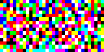

# min-ga
Genetic Algorithm - Minimum implementation in Python

The source code is being claimed by IBM Research and is no longer available free of use

# GA is guessing our 'secret word'

`python min-ga.py`

# GA can also guess our secret image!

`python img-ga.py`

